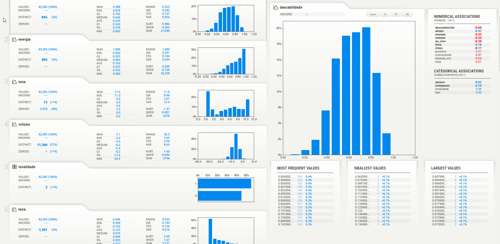

# Sistema de recomendação de músicas

Este projeto foi um job freelancer contratado por um aluno de curso de TI para execução de um trabalho semestral que ele já havia iniciado. Sendo assim todas as especificações de bibliotecas e metodologia foram selecionadas por ele, o nível de detalhamento também limitado por conta do curto prazo para entrega da tarefa (10 dias) que constituía em encontrar uma fonte de dados, analisar, preparar e desenvolver o modelo, entregar o código-fonte, scripts e notebooks, disponibilizar a aplicação funcionando mesmo que em servidor, repositório no github e documentação em formato de TCC, que aqui omiti para manter o anonimato.

## Etapa 1

Estudar e revisar a documentação já iniciada do trabalho para entender as especificações, datas e requisitos à serem entregues.

## Etapa 2 

Encontrar uma base de dados que pudesse ser utilizada para o projeto em si. O dataset principal foi retirado do Kaggle e correspondia a uma lista de features com características de músicas disponibilizada pelo Spotify para uma competição, [link aqui](https://www.kaggle.com/datasets/mrmorj/dataset-of-songs-in-spotify?select=genres_v2.csv). Como o dataset principal não tinha informações de título, intérprete e album, encontrei um json com mais de 1 milhão de dados sobre playlists do Spotify, [link aqui](https://www.aicrowd.com/challenges/spotify-million-playlist-dataset-challenge) onde consegui extrair as informações desejadas e juntar ao dataset principal.

## Etapa 3

Estudar, analisar, limpar e preparar o dataset para aplicação do modelo. Foi realizado uma análise exploratória para entender a distribuição dos dados, a importância das features e suas relevâncias para o fim buscado, simplificação dos dados sem perder objetividade.

## Etapa 3

Criar um modelo K-means conforme requisitos da entrega, aplicar o WSS Score para verificar a quantidade de clusters mais indicadas para os dados em questão, aplicar técnica de redução de dimensionalidade usando a biblioteca Principal Component Analysis (PCA). Fazer um teste usando o resultado da WSS Score como ponto de partida para testar o resultado da métrica Silhouette Score, que é muito mais confiável que a WSS por calcular a distância intra-clusters e extra-clusters, testando N quantidade de clusters. Após encontrar o valor de K ideal implementar o K-means, plotar o resultado para uma verificação visual dos clusters assim como o resultado do Silhouette Score e inserir novos dados para verificar o funcionamento do modelo.

## Etapa 4

Desenvolver uma interface gráfica para apresentar o resultado. Nesta etapa eu escolhi a bilbioteca [Streamlit](https://streamlit.io/), desenvolvida em python, que é uma ferramenta de prototipação web que prega os seguintes principios:

**Embrace scripting**
Construir um aplicativo com poucas linhas de código e vê-lo atualizar automaticamente as informações enquanto salva o arquivo fonte.

**Weave in interaction**
Adiconar elementos no aplicativo como se fosse instanciar uma variável sem precisar de um codar backend, definir rotas e sem precisar de HTML, CSS ou Javascript.

**Deploy instantly**
O deploy é bem simples e pode até ser hospedado diretemante na página do Streamlit, com algumas limitações.

Segue alguns prints da interface:

